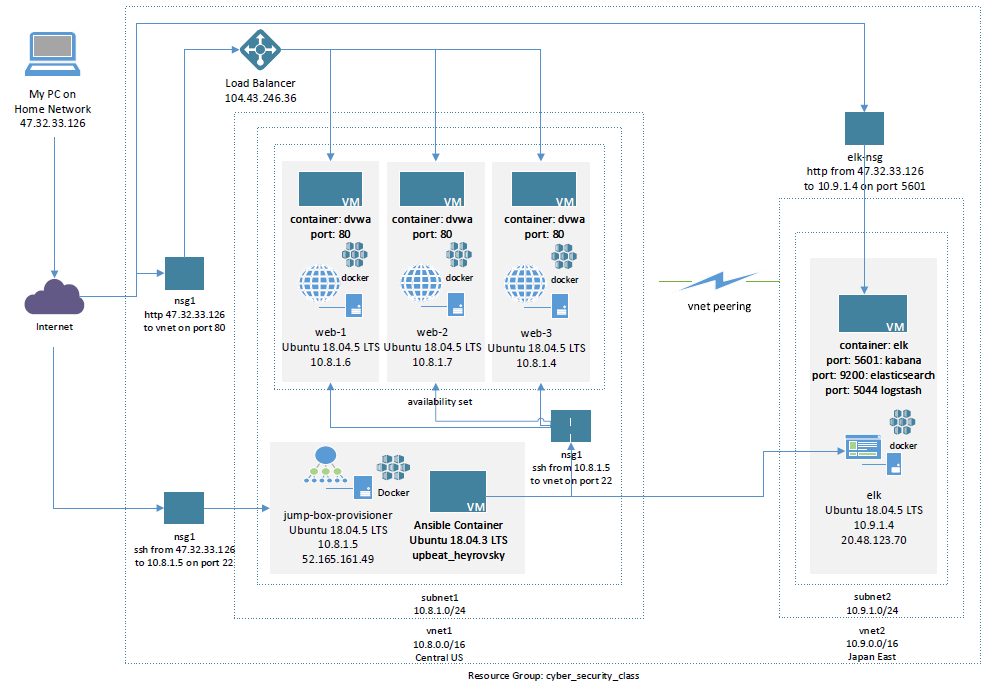
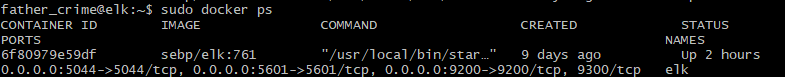

## Automated ELK Stack Deployment

The files in this repository were used to configure the network depicted below.

These files have been tested and used to generate a live ELK deployment on Azure. They can be used to either recreate the entire deployment pictured above. Alternatively, select portions of the filebeat-playbook.yml file may be used to install only certain pieces of it, such as Filebeat.

  - _ansible/elk.yml_

This document contains the following details:
- Description of the Topology
- Access Policies
- ELK Configuration
  - Beats in Use
  - Machines Being Monitored
- How to Use the Ansible Build

### Description of the Topology

The main purpose of this network is to expose a load-balanced and monitored instance of DVWA, the Damn Vulnerable Web Application.

Load balancing ensures that the application will be highly available, in addition to restricting access to the network.
- _The load balancer helps protect against DDoS attacks._
- _Using a jump box makes it easier to set up firewall rules to restrict administrative access to a single engry point._

Integrating an ELK server allows users to easily monitor the vulnerable VMs for changes to the configuration and system logs.
- _Filebeat collects log file data and sends it to the ELK stack._
- _Metricbeat collects system performance metrics such as CPU and memory usage._

The configuration details of each machine may be found below.

| Name                 | Function               | Operating System   | Private IP | Public IP     |
|----------------------|------------------------|--------------------|------------|---------------|
| jump-box-provisioner | Administrative Gateway | Ubuntu 18.04.5 LTS | 10.8.1.5   | 52.165.161.49 |
| web-1                | Web Server             | Ubuntu 18.04.5 LTS | 10.8.1.6   | 104.43.246.36 |
| web-2                | Web Server             | Ubuntu 18.04.5 LTS | 10.8.1.7   | 104.43.246.36 |
| web-3                | Web Server             | Ubuntu 18.04.5 LTS | 10.8.1.4   | 104.43.246.36 |
| elk                  | System Monitoring      | Ubuntu 18.04.5 LTS | 10.9.1.4   | 20.48.123.70  |

### Access Policies

The machines on the internal network are not exposed to the public Internet. 

Only the jump-box-provisioner machine can accept SSH connections from the Internet. Access to this machine is only allowed from the following IP addresses:
- _47.32.33.126_

Machines within the network can only be accessed by jump-box-provisioner.
- _firewall rules on the network security group limit SSH for all computers to be from 10.8.1.5 only_

A summary of the access policies in place can be found in the table below.

| Machine              | Rule Name            | Publicly Accessible | Allowed IP Addresses | Allowed Ports | Network Security Group |
|----------------------|----------------------|---------------------|----------------------|---------------|------------------------|
| jump-box-provisioner | SSH_to_JumpBox       | Yes                 | 47.32.33.126         | ssh 22        | nsg1                   |
| web-1,2,3            | ssh_from_jumpbox     | No                  | 10.8.1.5             | ssh 22        | nsg1                   |
| elk                  | ssh_from_jumpbox     | No                  | 10.8.1.5             | ssh 22        | nsg1                   |
| all                  | incoming_web_traffic | Yes                 | 47.32.33.126         | http 80       | nsg1                   |
| elk                  | elk_5601             | Yes                 | 47.32.33.126         | http 5601     | elk-nsg                |

Note: the incoming_web_traffic rule can be opened to the world at a production go-live.

### Elk Configuration

Ansible was used to automate configuration of the ELK machine. No configuration was performed manually, which is advantageous for administration.
- _Ansible automation provides for easy configuration verification, reconfiguration, or replicating to another system._

The playbook implements the following tasks:
- _Install Docker to host containers_
- _Install pip3 for handling python modules_
- _Configure the VM for the required memory_
- _Install the ELK container on Docker_
- _Enable the Docker service_

The following screenshot displays the result of running `docker ps` after successfully configuring the ELK instance.

### Target Machines & Beats
This ELK server is configured to monitor the following machines:
- _10.8.1.6_
- _10.8.1.7_
- _10.8.1.4_

We have installed the following Beats on these machines:
- _Filebeat_
- _Metricbeat_

These Beats allow us to collect the following information from each machine:
- _Filebeat collects log file data and sends it to the ELK stack._
- _Metricbeat collects system performance metrics such as CPU and memory usage._

### Using the Playbook
In order to use the playbook, you will need to have an Ansible control node already configured. Assuming you have such a control node provisioned: 

SSH into the control node and follow the steps below:
- Copy the filebeat-playbook.yml file to /etc/ansible/
- Update the host file to include the IP address of the ELK server.
- Run the playbook, and navigate to Kibana on the ELK machine (ex: http://20.48.123.70:5601/app/kibana) to check that the installation worked as expected.  You should see data flowing from your web servers.

